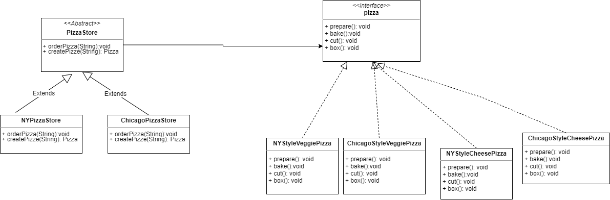

#### 简单工厂模式

> 工厂模式是最常用的，比如new对象就是工厂生产对象，工厂模式只是封装所有的new对象的操作

#### 工厂方法模式
> 通过让子类决定创建对象是什么，来达到对象创建过程封装的目的
> 工厂方法模式，主要针对多个同类型分工厂共同合作的情况，比如卖pizza的店，pizza的制作流程是一样的，
> 不同是pizza的制作的原料，风味，开的分店会根据当地风俗和习惯调整制作的配料

#### 抽象工厂模式
> 抽象工厂模式就是通过抽象方法创建相关或者依赖对象的家族，就是封装创建一组对象的模式

